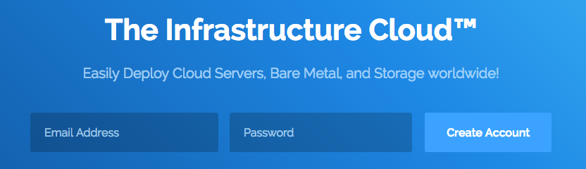
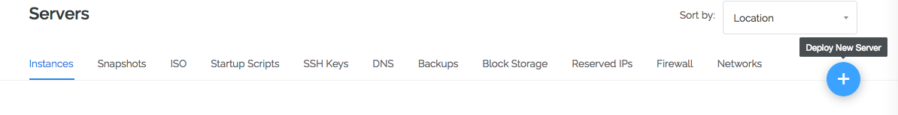
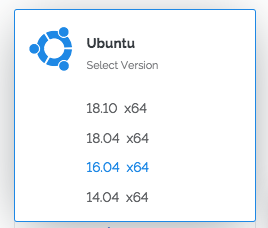
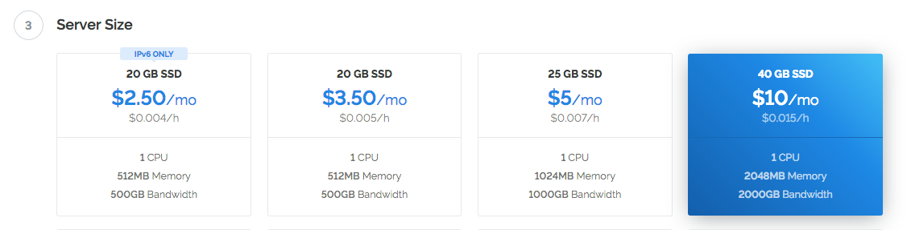
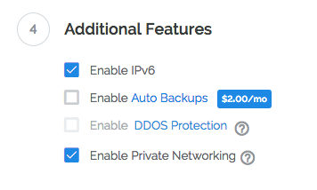
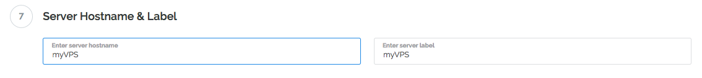
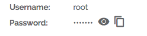

## What is a Virtual Private Server?

A virtual private server (VPS) is a computer on the cloud sold as a service by an Internet hosting service. It runs its own copy of an operating system (OS), and customers may access to that operating system instance, so they can install almost any software that runs on that operating system.

## Which service provider should i choose for my Virtual Private Server? 

We are going to use [https://www.vultr.com/](https://vultr.com/?ref=7664225) for this instructions.

You are free to choose any type of Internet Hosting Service that gives you multiple free IPv6 addresses.

[VULTR](https://www.vultr.com/?ref=7664225) allows for:

* Full "root" access and a dedicated IP address included with all VPS.
* Spin up and spin down with ease and *pay only for the hours you use* the platform.
* One-click: Restart, Reboot, Reinstall and more!
* Latest generation Intel CPUs guarantee consistent performance.
* 24/7 Customer support available.

## Step 1: Get a VPS!

Register an account on [Vultr](https://www.vultr.com/?ref=7664225).

Let's get prepared for installation

## Step 2: Deploy a new system

We will use only 1 server for this installation. Click that small "+" button to create your first server.

## Step 3: Location choice

Choose a location next to you from the available countries. 

## Step 4: Choose an operation system. 

Select Ubuntu 16.04 unless stated otherwise on your MYCE Hosting instructions.

## Step 5: Required Virtual Private Server

You can always enlarge your Virtual Private Server when working with Vultr so choose a suitable instance for the amount of masternodes your going to install.

You will *pay only for the hours you use*

+ The $5 instance is should be good enough for up to 5 masternodes.
+ The $10 instance is should good enough for up to 10 masternodes. 

## Step 6: Activate IPv6.

Multiple masternodes on one VPS require multiple IPv6 addresses. Toggle "Enable IPv6" to activate that feature for *free*

## Step 7: Name it

Just to be able to recognize it later on your Vultr dashboard name your VPS.  

## Step 8: Create it!

Hit the  to create your VPS. 

## Step 9: Grab your SSH details

Click on your newly created VPS on your Vultr dashboard to access your *root* and password

*Step 10: Enter this details on the MYCE Hosting Widget*

